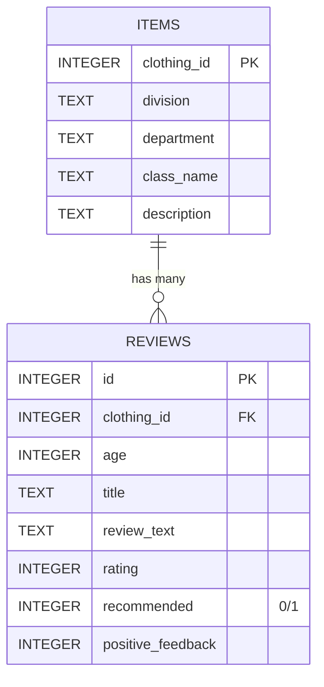

# 🧾 Review Classifier 

Review Classifier is a system built with **Flask + scikit-learn + SQLite + Python scripts** to classify clothing reviews as **Recommended / Not Recommended**.  
It extends **Milestone I** by training multiple models, combining them into an ensemble, and deploying them into a **Flask Web UI**.

---

## ✨ Features

- 📝 Train multiple models:
  - CountVectorizer + Logistic Regression
  - TF-IDF + Logistic Regression
  - TF-IDF + SVD + Logistic Regression
- 🤝 Final Ensemble: **equal-weight soft voting** of all three models.
- 📦 Export artifacts:
  - `model/ensemble.pkl` (scikit-learn VotingClassifier).
  - `model/manifest.json` (metadata).
- 🌐 Flask Web Application:
  - **Quick Predict** from review text (`/predict`).
  - **Add / Edit / Delete Reviews** interactively.
  - **AI Suggest**: auto-recommendation hint from classifier.
  - **Metrics page** for model status.
  - **Search + pagination** for browsing items.
- 🗂 Data management:
  - Dataset stored in **SQLite (`data/app.db`)**.
  - Items and reviews can be queried with pagination.

---

## ⚙️ Requirements

- Python **3.9+** (tested with 3.12).
- pip + venv.
- Git.
- SQLite (already bundled with Python).

---

 ## 🚀 Setup Guide

### 1. Clone the repository
 ```bash
 git clone https://github.com/vkquanghd/Clothing_Recomend_App.git
 cd review-classifier
 ```

 ### 2. Setup Virtual Environment

 On Mac/Linux:
 ```bash
 python3 -m venv .venv
 source .venv/bin/activate
 ```

 On Windows (PowerShell):
 ```powershell
 python -m venv .venv
 .venv\Scripts\activate
 ```

 ### 3. Install dependencies
 ```bash
 pip install --upgrade pip
 pip install -r requirements.txt
 ```

### 4. Preprocessing and Train Models with Notebooks

Open Jupyter Notebook:

```bash
jupyter notebook notebooks/preprocessing.ipynb
jupyter notebook notebooks/model_training.ipynb
```
 
 Run all cells to:
 - Preprocess and analyze the dataset.
 - Train 3 models.
 - Save the ensemble bundle (model/ensemble.pkl).
 - Generate data/site_items.json.

 ### 5. Run the Flask App

 Mac/Linux:
 ```bash
 flask run
 ```

 Windows (PowerShell):
 ```powershell
 set FLASK_APP=app
 set FLASK_ENV=development
 flask run
 ```

 👉 Now open: http://127.0.0.1:5000/

 ---

 🗂 Project Structure

review-classifier/
 ├── app/
 │   ├── controllers/   # Flask routes (main, review, model_info)
 │   ├── templates/     # HTML templates (detail.html, predict.html, metrics.html, base.html)
 │   ├── static/        # CSS, JS, images
 │   └── __init__.py
 ├── data/
 │   ├── app.db         # SQLite database
 │   ├── site_items.json
 │   ├── site_reviews.json
 │   └── assignment3_II.csv
 ├── model/
 │   ├── ensemble.pkl   # Exported ensemble
 │   └── manifest.json
 ├── notebooks/
 │   └── model_training.ipynb
 │   └── preprocessing.ipynb
 ├── requirements.txt
 └── README.md

 ---

 ## 📊 Dataset

 Using the **Women’s E-Commerce Clothing Reviews** dataset with columns:
 - `Clothing ID`
 - `Age`
 - `Title`
 - `Review Text`
 - `Rating`
 - `Recommended IND` (target label)
 - `Division Name`
 - `Department Name`
 - `Class Name`


## 🗄️ Database Schema

The dataset is split into two tables inside **SQLite**:

### `items`
- `clothing_id` (**PK**)  
- `division`  
- `department`  
- `class_name`  
- `description`  

### `reviews`
- `id` (**PK**)  
- `clothing_id` (**FK → items.clothing_id**)  
- `age`  
- `title`  
- `review_text`  
- `rating`  
- `recommended`  
- `positive_feedback`  


📐 ERD


---


 ## 📈 Models

- **Base Models**
  - CountVectorizer + Logistic Regression  
  - TF-IDF + Logistic Regression  
  - TF-IDF + SVD + Logistic Regression  

- **Final Model**
  - Ensemble of all three (equal weights)  

 Metrics evaluated:
 - Accuracy
 - F1 score
 - ROC-AUC

